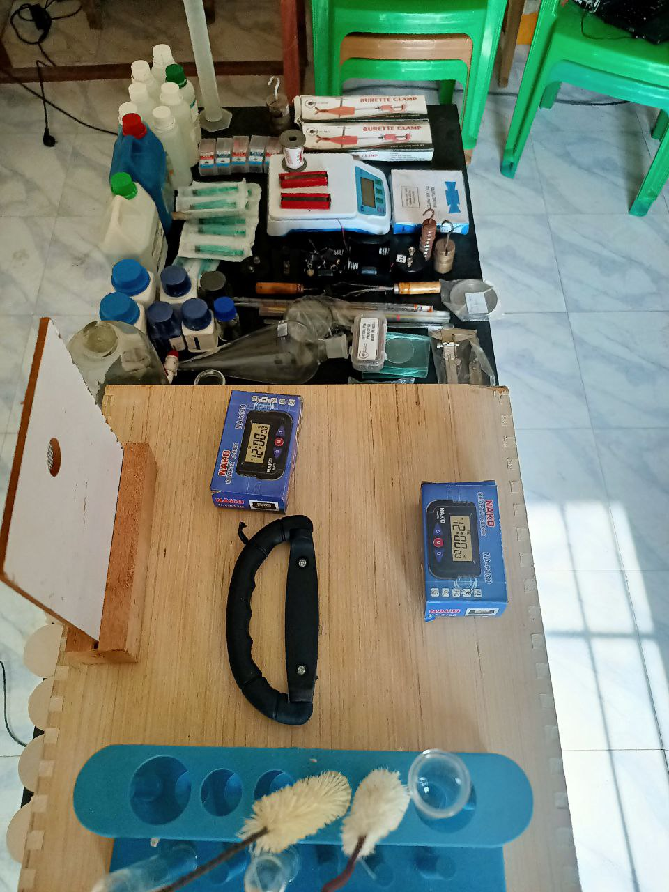

# ASKsek-Launched-in-Bor-Town-

Ataka Hub, Launched ASKsek **(Access to skills and Knowledge science experiment kit)**, a mobile kit that shall be able to provide laboratory tools and materials and reagensts to enhance the learning of sceince subjects in schools by advocating for practical lessons in schools in Bor town, South Sudan!

 
Vine High secondary schools with a population of about 250 students with over 100 of them being  s4 students waiting to sit for their exams later in the year, but these numbers come with a looming challenge, “we have never done any practical lessons for the students offering science subjects, making it hard for them to understand what has been taught or what may likely be examined” said worried Science teacher Mr. Nyiko Baptist, as he talks during an interview just before the launch of the ASKsek.

 

During the Launch of the ASKsek, Mr. Nyiko Baptist organised a physics practical session with the S4 students with a focus on ‘Motion Under Gravity”.
With the available tools in the ASKSek, Baptist was able to use;
- Retort Stand with Clamps, 
- A piece of thread(120cm), 
- A stop watch/Clock, 
- A pendulum Bob, 
- Meter Rule  of which all the needed apparatus where available in the ASKsek.

According to the Programs Manager of Ataka Hub, Ghai Tong , the ASksek contains science equipments for,
- Biology Practicals, I.e (Microscope, slides, 
- Physics Practicals I.e (retort stands, clamps, pendulum bob, masses, Glass block, meter rule etc.
- Chemistry, (Reagents, acids, chemicals, indicators, and many more

**ASKsek and ASKnet**
# ASKsek: 
This is part of the ASKnet events and activities that are aimed at providing skills, and knowledge to communities with difficult in accessing information and resources, by the provision of tools and materials to schools to hence solve local challenges affecting the education sector in Bor this event becomes part of the series of events and projects implemented under the ASKnet project that is implemented by 5 Hubs in Uganda, Juba and Bor!.

These different hubs have different methodologies of approaching problems that affect their communities, in very unique and innovative ways just like the ASKsek that seeks to provide access to tools and materials and reagents (Lab equipment) in mobile kit that can be accessed by over 7 schools in the town suffering a dare need to laboratory equipment to enhance the learning of science subjects in these schools.

**Testimonials**

**David Dhieu s4 student**, says “we believe by seeing, if we can’t see what we learn we shall forget it!, I saw how the pendulum bob was moving. We need more practicals in physics and chemistry, and its my first time doing practicals and its exciting”
“The more the practicals the more students can easily chose science subjects”

**Yom Duom, s4 student**, “ I feel excited after doing my first practicals, and as I do sciences I can say that science subjects are not difficult just that the fact that we don’t have science subjects make it very difficult to understand “
Baptist, science teacher, vine secondary school.  People understand, they are bright but the absence of practicals, will make just get papers but with no knowledge, we need more of this nation wide.

**Malaual Peter Dau Head teacher, Vine secondary school**  
We have partnered with Ataka Hub for a while, and we are very happy of what they have introduced to the learners because the world has become very practicals, they learn theroires in sciences yet other part of Africa students are learning practicals, at least a science student should know what is a , bused burner etc at least then they can start liking and loving the subject!”  

**Bior Ajang - ED Ataka HUB Bor**
Science subjects are simple but the reason why students fear science subjects is because there is nothing that simplify the science subjects that’s why we are standing up for our students to make science subject simple and understandable. 

# partners
This project is supported by R0g **(Agency for development and critical transformation)** through #ASKnet **(Access to skills and knowledge network)** with funds from BMZ to ATaka HUB in bor south sudan.
|r0g Agency|ASKnet|ATaka HUB|
|:--------:|:----:|:-------|
||| 
| [Official website](https://openculture.agency/)| [official website](https://github.com/ASKnet-Open-Training)| [official website](https://www.weareasknet.org/ataka-hub/)

